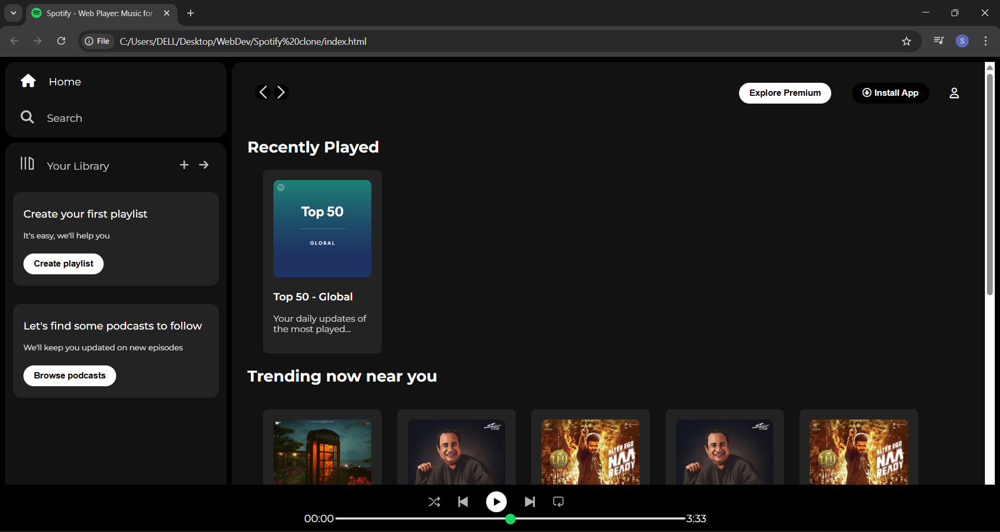

# 🎵 Spotify Web Clone

A fully responsive frontend clone of the **Spotify Web Player** using **HTML, CSS**, and **Font Awesome**. This project recreates the look and feel of Spotify’s UI — including navigation, library section, playlists, and a static music player.

---

## ✨ Features

- 🎧 Left sidebar with **navigation** and **your library**
- 🔍 Sticky top nav with **install** and **profile** icons
- 📂 Card sections for:
  - Recently Played
  - Trending near you
  - Featured Charts
- 🎶 Music player layout at the bottom (UI only)
- 🎨 Responsive design and smooth layout
- 🧩 Font Awesome icons for interactivity

---

## 🔧 Tech Stack

- HTML5
- CSS3 (Flexbox, Media Queries)
- Font Awesome (for icons)
- Google Fonts (`Montserrat`)

---

## 🖼️ Preview

---

---

## 📚 What I Learned

- Building clean layouts with Flexbox
- Working with icons using Font Awesome
- Designing responsive cards and navbars
- Organizing a large project structure with assets

## 📩 Feedback

If you have suggestions or feedback, feel free to reach out or open an issue.

---

👩‍💻 Built with 💙 by [Swati Thakur](https://github.com/codebyswatii)